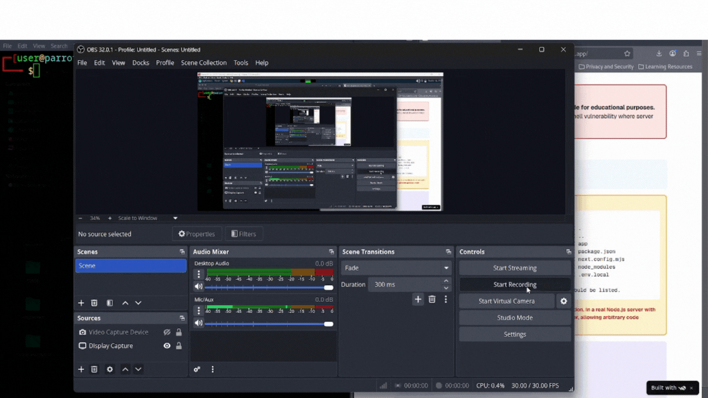

# React2Shell Nuclei Templates

Nuclei templates to detect and confirm exposed React/Webpack
development servers that may lead to React2Shell-style RCE when combined
with additional misconfigurations.

The templates are split into two stages:
1. Passive detection (safe)
2. Active confirmation (authorized testing only)

## How the templates work

The detection template sends harmless GET requests to common React
development server endpoints and matches known dev-only responses.
If these endpoints are exposed, the target is marked as a potential
React2Shell candidate.

The confirmation template confirms unauthenticated remote code execution in vulnerable Next.js React Server Component apps by executing a server-side command and verifying its output via a forced Next.js redirect.

## Usage

> nuclei -u http://target -t react2shell-detect.yaml  
> nuclei -u http://target -t react2shell-confirm.yaml

## Demo

For educational and defensive security testing only.
Do not use on systems without explicit permission.

Author: Darshan Jogi

